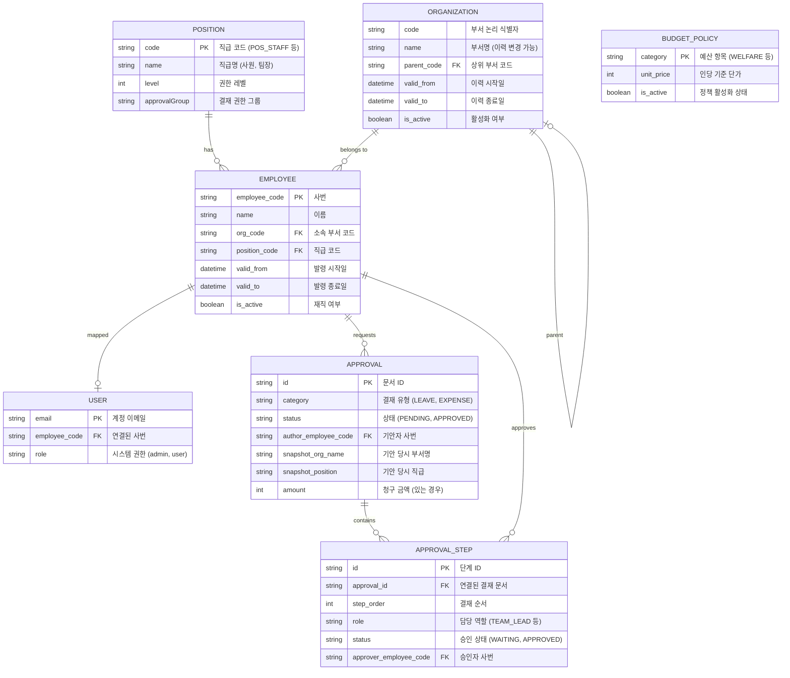

# VIBE HR System

이 프로젝트는 조직 개편 및 인사 정보를 체계적으로 관리하는 **이력 추적형 인사 관리 시스템(HR System)**입니다. 조직 개편, 부서 이동, 사원 발령 시 과거 데이터를 파기하지 않고 기록을 보존하며, 특정 시점의 조직도를 재현하거나 결재 당시의 정보를 추적할 수 있는 기능을 제공합니다.

---

## 🚀 주요 기능 (Core Features)

### 1. 조직 및 사원 관리 (이력 관리)
- **과거 데이터 보존**: 모든 부서 및 사원 정보는 `validFrom`, `validTo` 기반으로 관리되어 변경 전 기록이 유실되지 않습니다.
- **타임머신(Time Machine)**: 특정 날짜를 선택하여 과거의 조직 구조와 사원 배치를 조회할 수 있습니다.
- **유연한 조직 개편**: 부서 생성, 이름 변경, 상위 부서 변경 시 기존 이력을 보존하면서 새로운 정보를 업데이트하여 데이터 무결성을 유지합니다.

### 2. 전자결재 시스템 (Approval System)
- **스냅샷 결재**: 기안 시점의 기안자 정보(이름, 소속, 직급)와 결재선 정보를 스냅샷으로 저장하여, 이후 조직 개편이 발생해도 결재 문서의 정합성을 유지합니다.
- **비용 집계**: 휴가, 비용 청구, 증명서 신청 등 다양한 카테고리의 결재를 지원하며, 실시간 비용 검증(예산 체크)을 수행합니다.

### 3. 통계 및 비용 대시보드 (Statistics)
- **조직별 비용 집계**: 기간별, 부서별 지출 현황을 시각화합니다.
- **예산 정책 관리**: 항목별 인당 기준 단가를 설정하고 실지출액과 대조하여 통계 데이터를 제공합니다.

---

## 🛠 기술 스택 (Tech Stack)

- **Framework**: [Next.js 16 (App Router)](https://nextjs.org/)
- **Language**: [TypeScript](https://www.typescript.org/)
- **Database ORM**: [Prisma](https://www.prisma.io/)
- **Database**: SQLite (Development)
- **Styling**: [Tailwind CSS v4](https://tailwindcss.com/), [shadcn/ui](https://ui.shadcn.com/)
- **Validation**: [Zod](https://zod.dev/)
- **Authentication**: Custom Session Management (Cookie-based)
- **Icons**: [Lucide React](https://lucide.dev/)
- **Charts**: [Recharts](https://recharts.org/)

---

## 📊 데이터베이스 구조 (ERD)

프로젝트의 주요 테이블 간 관계는 다음과 같습니다. (Mermaid 다이어그램)



---

## 📑 스키마 상세 설명

본 시스템은 데이터의 원자성(Atomicity)과 시계열 이력 추적(Traceability)을 보장하기 위해 다음과 같은 구조로 설계되었습니다.

### 1. 조직 및 인사 관리 (Organization & HR)
부서 및 사원 정보의 변경 사항을 덮어쓰지 않고 새로운 레코드로 생성하여, 특정 시점의 조직 데이터를 조회할 수 있는 **이력 추적형(SCD Type 2)** 기반으로 작동합니다.

| 테이블 | 주요 역할 | 핵심 로직 |
| :--- | :--- | :--- |
| **Position** | 직급 권한 및 체계 정의 | 각 직급별 결재 권한 그룹(`approvalGroup`)과 서열(`level`)을 관리합니다. |
| **Organization** | 부서 구조 및 이력 보존 | 상하 관계(`parentCode`)와 유효 기간(`validFrom/To`)을 통해 조직 개편 전후의 상태를 모두 보존합니다. |
| **Employee** | 사원 기본 정보 및 발령 이력 | 사원의 정보 변경 시 기존 정보를 '닫고' 새로운 정보를 '여는' 방식으로 운영되어, 사원의 부서 이동 경로를 추적합니다. |

---

### 2. 전자결재 시스템 (Approval System)
결재 프로세스 중 발생하는 데이터의 왜곡을 방지하기 위해 생성 시점의 정보를 고정하는 **스냅샷(Snapshot)** 아키텍처를 사용합니다.

| 테이블 | 주요 역할 | 핵심 로직 |
| :--- | :--- | :--- |
| **Approval** | 결재 문서 생성 및 스냅샷 보존 | 기안 시점의 기안자 이름, 소속, 직급 정보를 필드에 직접 박제하여 이후 조직 개편 등의 영향을 받지 않도록 합니다. |
| **ApprovalStep** | 결재선 단계 및 승인 로직 | 결재 순차(`stepOrder`)와 승인자 권한을 관리하며, 단계별 승인 시점의 상태를 독립적으로 기록합니다. |

---

### 3. 시스템 설정 및 예산 정책 (System & Policy)
| 테이블 | 주요 역할 | 핵심 로직 |
| :--- | :--- | :--- |
| **User** | 인증 및 권한 관리 | 실제 인사 데이터(`Employee`)와 연동되어 시스템 접근 여부 및 관리자 권한을 부여합니다. |
| **BudgetPolicy** | 예산 검증 및 산출 기준 | 항목별 인당 기준 단가를 설정하며, 비용 청구 결재 시 실시간 검증 및 통계 산출의 모집단이 됩니다. |

---

### 💡 시스템 운영 원칙
1.  **Logical Mapping**: 테이블 간 연결 시 고정된 `code`를 활용하여 데이터 이력 전환 시에도 관계를 유지합니다.
2.  **Audit Trail**: 모든 데이터의 생성/수정/삭제 시점을 추적하며, 특히 `is_active` 필드와 유효 기간을 병용하여 데이터 무결성을 보장합니다.
3.  **Immutable Logs**: 승인된 결재 서류와 확정된 발령 정보는 수정이 불가능하도록 설계되어 데이터 신뢰도를 높입니다.

---

## 📂 프로젝트 구조 (Project Structure)

프로젝트는 도메인 중심의 **Feature-based Architecture**를 따릅니다.

```text
src/
 ├── app/                    # 라우팅 (Pages & Layouts)
 ├── features/               # 도메인 단위 비즈니스 로직 (Core)
 │   ├── organization/       # 조직/사원 관리
 │   ├── approval/           # 전자결재 시스템
 │   └── statistics/         # 통계 및 대시보드
 ├── services/               # 공통 비즈니스/연산 로직 (Unit Testable)
 ├── components/             # 전역 공유 UI 컴포넌트 (shadcn/ui 포함)
 ├── lib/                    # 인프라 설정 (prisma, auth, utils)
 └── types/                  # 전역 타입 정의
```

---

## 🚦 시작하기 (Getting Started)

### 1. 의존성 설치
```bash
npm install
```

### 2. 데이터베이스 설정 및 마이그레이션
```bash
# Prisma Client 생성
npx prisma generate

# DB 스키마 동기화 (SQLite)
npx prisma db push
```

### 3. 초기 시드 데이터 생성
테스트를 위한 관리자 계정 및 SCD 이력이 포함된 데이터가 생성됩니다.
```bash
npx prisma db seed
```

### 4. 개발 서버 실행
```bash
npm run dev
```
접속 주소: [http://localhost:3000](http://localhost:3000)

---

## 🔑 테스트 계정
시드 데이터를 통해 생성된 주요 계정 정보입니다. (비밀번호: `admin123` 또는 `password123`)

- **관리자**: `admin@company.com`
- **본부장**: `head@company.com`
- **팀장급**: `lead1@company.com`, `lead2@company.com`
- **사원급**: `user1@company.com`, `user2@company.com`

---

## 📜 설계 원칙
1. **데이터 이력 보존**: 기존 데이터를 수정하는 대신 기간 정보를 이용해 기록을 보존하여 누적 데이터를 관리합니다.
2. **Atomic Transaction**: 이력 생성 및 관련 업데이트 작업은 반드시 Prisma 트랜잭션 내에서 처리됩니다.
3. **RSC First**: 데이터 페칭은 서버 컴포넌트에서 우선적으로 처리하며, 인터랙션이 필요한 부분만 클라이언트 컴포넌트로 분리합니다.
